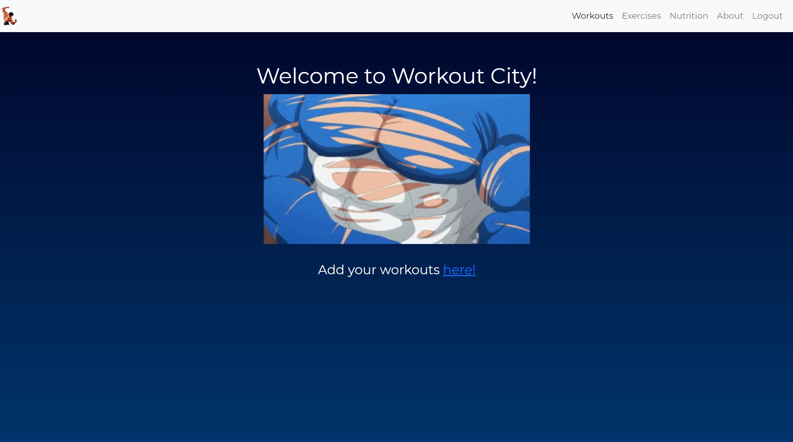
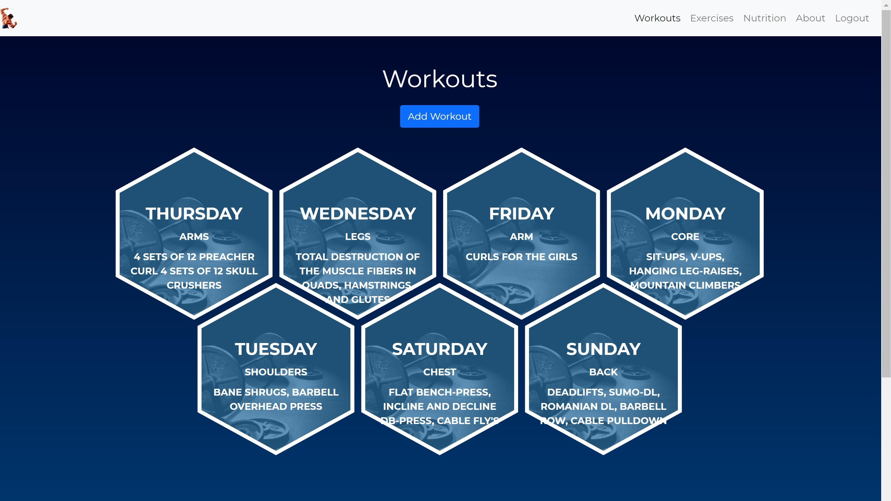

# TEAM MGM welcomes you to Workout City

***

## Getting started

[Click here to visit Workout City!](https://workoutcity.herokuapp.com/)

***

[Trello Board](https://trello.com/b/ORis8N6x/workout-city)

***

Once logged in, as a user you'll be able to utilize the full power of the Workout City application to Create, Update and Delete all your favorite Workouts, Exercises and Nutrition Plans. PostgreSQL database allows the user to save their data in their user profile for later use.

***

## Stack: Workout City is a full-stack Django web application using:

1. Python
2. PostgreSQL

## Additional technologies include:

* HTML5 / CSS3
* Bootstrap
* Django
* Django Auth

***

## Next Steps:

* Include a video streaming feature that shows user how to do any exercise they add to their profile or query from an API we apply to the app.
* Body Fat Tracker feature
* Dashboard feature on user's personal profile page
* A graph/chart that displays the user's progress displaying how often they've been working out based off their logs.